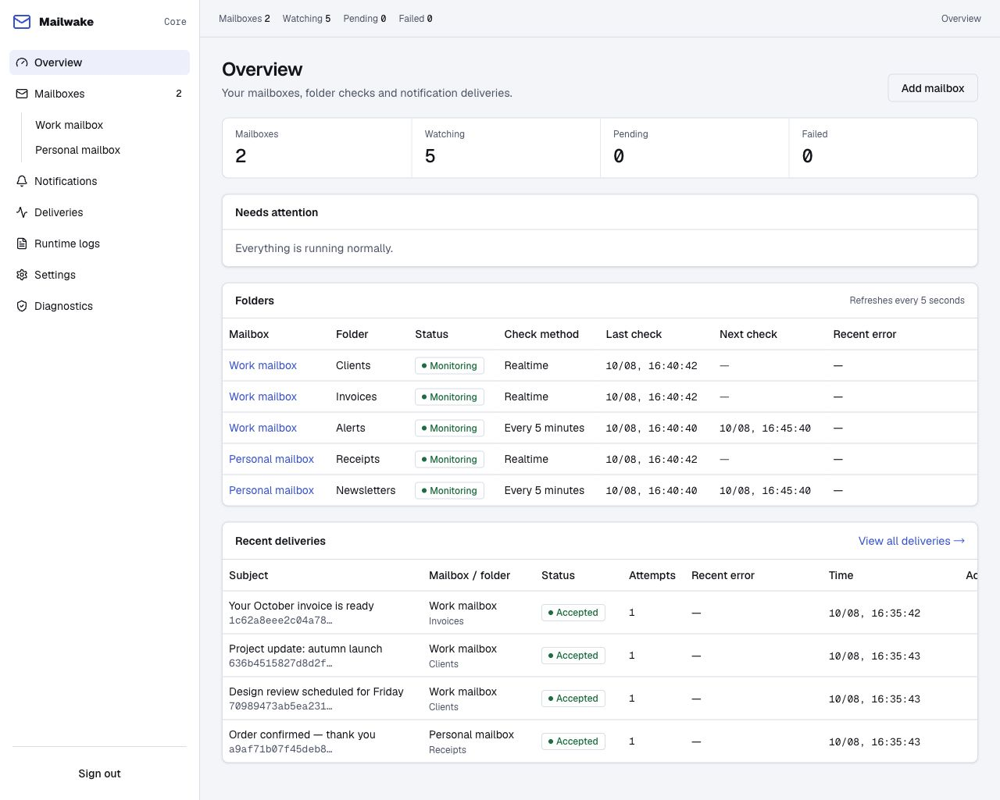
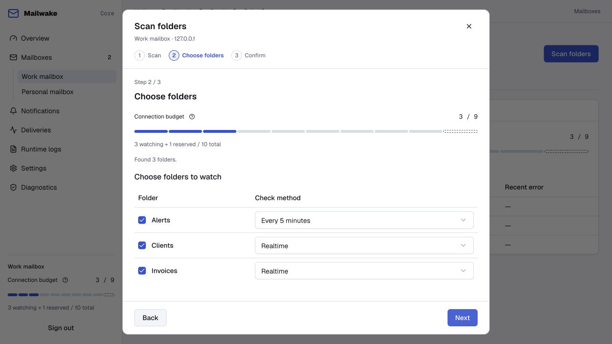

# Mailwake

**Notifications for the email folders that matter.**

[](https://github.com/mingzaily/mailwake/actions/workflows/ci.yml)
[](LICENSE)

English · [简体中文](README.zh-CN.md) · [Documentation](docs/README.md) · [Releases](https://github.com/mingzaily/mailwake/releases)

Mailwake monitors IMAP folders on your own server. When a mail rule moves a message into a folder, receive a notification through Bark, Pushover or a signed webhook. Keep reading and replying in your usual email client.

## What you can do

- **Choose the folders that matter.** Connect up to 20 mailboxes and choose realtime IMAP IDLE or scheduled checks for each folder.
- **Use your preferred notification channel.** Configure notification previews and retries for Bark, Pushover or webhooks.
- **Manage everything in your browser.** Set up mailboxes, inspect delivery history and diagnose issues in nine languages: English, Simplified Chinese, Traditional Chinese, Japanese, Korean, German, French, Spanish and Brazilian Portuguese.
- **Keep state on your server.** Credentials are encrypted; SQLite preserves monitoring progress and pending notifications across restarts.

The self-hosted service, Web console and script API are free to use. The official App and Pro services are separate integrations; see [App integration](docs/native-push.md).

## Quick start

You need Git, Docker Compose v2 and a mailbox with TLS IMAP enabled. Use an app password or authorization code when your email provider requires one.

```sh
git clone https://github.com/mingzaily/mailwake.git
cd mailwake
docker compose up -d --build --pull never
docker compose logs core
```

1. Open **http://127.0.0.1:8080** on the Docker host.
2. Enter the setup code from the logs and create an administrator account with a password of at least 12 characters.
3. Add a mailbox and select the folders to monitor.
4. Open notification settings, configure a channel and send a test notification.

The commands above build the current `main` source. **v1.0.0-rc.7** is the current release candidate for 1.0.0. The default port binds to localhost, and data persists in a Docker volume. For remote access, HTTPS, backups and upgrades, follow the [deployment guide](docs/deployment.md).

Prefer a prebuilt package? [Download macOS/Linux binaries](https://github.com/mingzaily/mailwake/releases/tag/v1.0.0-rc.7) or use the container image `ghcr.io/mingzaily/mailwake:v1.0.0-rc.7` (amd64 and arm64). The `main` branch tracks ongoing development. Changes are recorded in [CHANGELOG.md](CHANGELOG.md).

## A look inside

Monitor mailbox connections and folder activity from the overview.



<details>
<summary>Folder selection and connection budget</summary>



</details>

*Screenshots use demonstration mailboxes and synthetic messages; appearance may vary by version.*

## Documentation

| I want to… | Guide |
| --- | --- |
| Deploy, upgrade or back up Mailwake | [Deployment](docs/deployment.md) |
| Check provider compatibility and folder behavior | [Mailbox monitoring](docs/monitoring.md) |
| Configure notification channels and webhooks | [Notifications](docs/notifications.md) |
| Connect the official App | [App integration](docs/native-push.md) |
| Automate management tasks | [HTTP API](docs/api.md) |
| Build locally or contribute a change | [Contributing](CONTRIBUTING.md) |

See the [documentation index](docs/README.md) for console and storage references. Report bugs through [GitHub Issues](https://github.com/mingzaily/mailwake/issues); report vulnerabilities privately as described in [SECURITY.md](SECURITY.md).

## License

The self-hosted Core in this repository is licensed under **AGPL-3.0-only**. See [LICENSE](LICENSE) and [COPYRIGHT](COPYRIGHT). Third-party components retain their own licenses; notices are included in builds.
