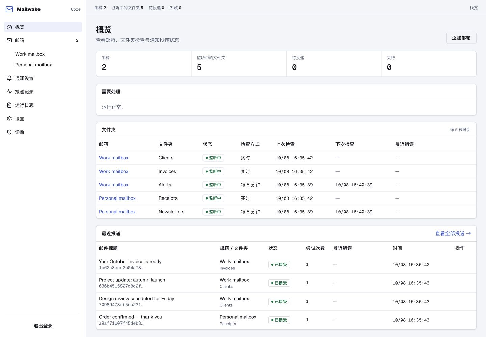
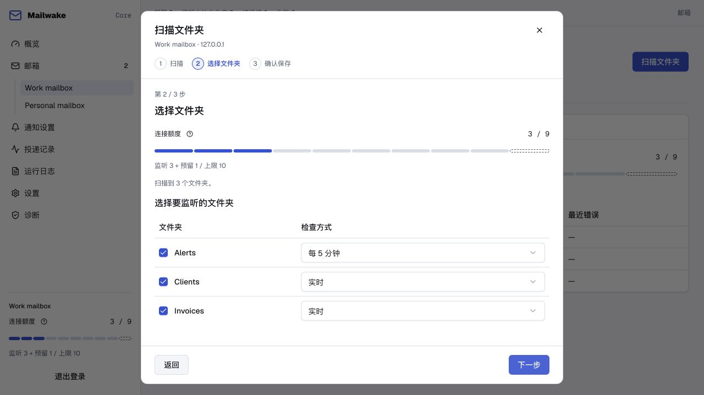

# Mailwake Core

**让重要文件夹里的邮件，也能及时通知你。**

[](https://github.com/mingzaily/mailwake/actions/workflows/ci.yml)
[](LICENSE)

[English](README.md) · 简体中文

Mailwake Core 是一个自部署的 IMAP 文件夹监听服务。邮件被规则自动归类后，Core 仍可通过 Bark、Pushover 或签名 Webhook 发送通知。阅读和回复继续使用你习惯的邮件客户端。



<details>
<summary>查看文件夹选择与检查方式</summary>



</details>

*截图使用本地演示邮箱和模拟邮件。*

## 功能

- **按文件夹监听**：最多连接 20 个邮箱，每个文件夹可选择 IMAP IDLE 实时监听或定时检查。
- **自选通知服务**：接入 Bark、Pushover 或签名 Webhook，配置通知预览与重试。
- **持久化投递队列**：SQLite 保存监听进度与待发通知，重启后继续处理。
- **内置 Web 控制台**：管理邮箱、文件夹、投递记录和诊断，支持中英文。
- **独立部署**：Go 二进制内嵌 Web 资源，凭据加密保存，数据存储在自己的服务器。

Core、Web 控制台和脚本 API 免费使用。官方 Mailwake App 与 Pro 服务通过独立接口接入，详见 [App 接入说明](docs/native-push.zh-CN.md)。

## 快速开始

准备 Git、Docker Compose v2，以及支持 TLS IMAP 的邮箱。按邮箱服务商要求使用应用专用密码。

```sh
git clone https://github.com/mingzaily/mailwake.git
cd mailwake
docker compose up -d --build --pull never
docker compose logs core
```

在 Docker 所在主机打开 **http://127.0.0.1:8080**，输入日志中的设置码，创建至少 12 位的管理员密码，然后添加邮箱并选择需要监听的文件夹。

默认端口仅绑定本机，数据保存在 Docker 持久卷。远程访问、HTTPS、备份和升级步骤见 **[部署指南](docs/deployment.zh-CN.md)**。

## 发布状态

公开的 `main` 分支包含面向 1.0.0 的开发源码，上述命令会在本地构建。版本镜像统一发布到 **`ghcr.io/mingzaily/mailwake`**；二进制和发布说明随正式版本提供，见 [GitHub Releases](https://github.com/mingzaily/mailwake/releases)。

## 文档

| 指南 | 内容 |
| --- | --- |
| [部署](docs/deployment.zh-CN.md) | Docker、HTTPS、备份、升级和密码恢复 |
| [邮箱监听](docs/monitoring.zh-CN.md) | 邮箱兼容性、文件夹行为与数据隐私 |
| [通知通道](docs/notifications.zh-CN.md) | 通知渠道、预览和 Webhook 签名 |
| [HTTP API](docs/api.zh-CN.md) | 鉴权、邮箱配置、投递与运行日志 |
| [App 接入](docs/native-push.zh-CN.md) | 原生推送、设备配对与正文授权 |
| [参与开发](CONTRIBUTING.md) | 开发环境、检查、贡献规范与版本发布 |

管理界面、存储等参考说明见[完整文档目录](docs/README.zh-CN.md)。

## 贡献与安全

欢迎提交问题与范围明确的改进。发起 Pull Request 前请阅读 [CONTRIBUTING.md](CONTRIBUTING.md)；安全漏洞请通过 [SECURITY.md](SECURITY.md) 中的渠道私下报告。

## 许可证

Mailwake Core 使用 **AGPL-3.0-only**，详见 [LICENSE](LICENSE) 与 [COPYRIGHT](COPYRIGHT)。第三方组件保留各自许可证，相关声明随构建产物提供。
